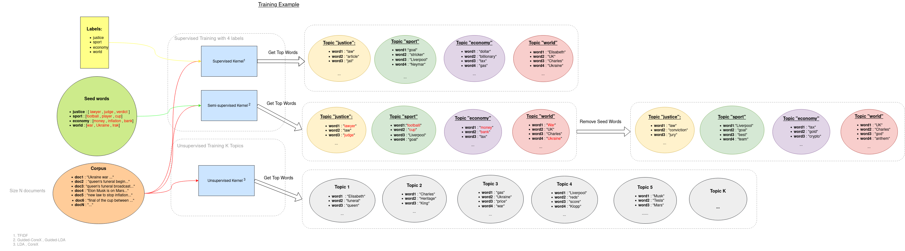

# Novelties Detection

Novelties Detection project is a **real-time automatic newspaper semantic analyser** that provide you keywords and set of keywords for different thematics
inside newspaper data .
The purpose of the project is to have better understanding of novelties in actuality and detect when actuality change appear.

## About the project.

Firstly the service collect data from various newspaper on the web in real-time
thanks to rss feeds that contain information about new articles posted every moment by the paper company which handle this rss feed server.
If you want to learn more about rss feed usage ,  see [here](https://en.wikipedia.org/wiki/RSS).

Secondly we want to use texts from the articles to apply topic model algorithm that return us keywords and thematics contain in the corpus (in our case the articles collected in the considered time window).
so we apply data cleaning and text pre-processing before processing.

Finally, the service analyse the articles collected and is able to provide thematics and keywords that appear,
disappear or stable during a certain time window ( ex : the words queen , Elisabeth , death appear in the window 19h - 20h Friday 09/09/2022).
the news analysis is sequential that means that the current window of data that contain the article information of this time window is compared to the last window that contain article information of the last time window.
We use topic model method to get the words clusters that represent thematic with strong relationship in our window of data, and we can calculate the similarity between 2 consecutive windows using Jaccard distance.

Basic architecture schema:


for each blue point you can refer to the section [explanation](#explanation) , this will help you to understand how configure your service
differently than the default settings.

## Installation and Execution

### Prerequisite

if you are on Ubuntu 20.04 , you can follow the kit shell installation as referred [here](#with-shell) .
else you can use docker , referred to this [section](#with-docker) but first you need to install docker-engine on
your machine . The installation steps of docker engine for your operating systems might be slightly different,
please refer to the [docker documentation](https://docs.docker.com/engine/install/) for details.

### with Shell

make sure that you have pip for python 3.8 install on your machine else you can use the following commands
for pip installation:

```bash
#Start by updating the package list using the following command:
sudo apt update
#Use the following command to install pip for Python 3:
sudo apt install python3-pip
#Once the installation is complete, verify the installation by checking the pip version:
pip3 --version

```

then you can follow the commands bellow to install the service and run it :

```bash
#first download repo from github and unzip.
wget https://github.com/AntMouss/Novelties-detection-project/archive/master.zip -O novelties-detection-master.zip
unzip novelties-detection-master.zip

#changes current directory.
cd Novelties-detection-project

#create service environnement
python3 -m venv ./venv

#activate environment
source ./venv/bin/activate

#install dependencies with pip
pip install -r requirements.txt

# set OUTPUT_PATH environment variable to activate writing mode and have the service persistent
# else ignore this command
export OUTPUT_PATH=<output_path>
```

Now you can run the server with the default settings, or you can set your own settings overwriting the `config/server_settings.py` file.
see [here](#settings) for more details about the server settings.

```bash
#launch the server
python3 server.py
```

If you don't specify `output_path` the collect service will not be persistent.

### with Docker

You can build the image directly from this GitHub directory using the following command,
but you can set your own settings in this way.

```bash
# build image from github repo.
docker build --tag novelties-detection-image https://github.com/AntMouss/Novelties-detection-project.git#main
```

to use your own server settings you need to download the repository and overwrite the `config/server_settings.py` file.
see more [here](#settings).

Bellow the commands for downloading the repository and change current directory.

```bash
#first download repo from github and unzip.
wget https://github.com/AntMouss/Novelties-detection-project/archive/master.zip -O novelties-detection-master.zip
unzip novelties-detection-master.zip

#change current directory.
cd Novelties-detection-project

```

Run the container with persistent way.

```bash
# run container from the image that we build previously with creating volume that contain collect data (persistence activate) .
docker run -d -p 5000:5000 \
--name <container_name> \
--mount source=<volume_name>,target=/collect_data \
-e OUTPUT_PATH=/collect_data \
novelties-detection-image:latest
```

or choose the no persistent way with the following command.

```bash
docker run -d -p 5000:5000 --name <container_name> novelties-detection-image:latest
```

Then you can check the logs of the sever to check is everything is OK , or navigate in the volume if you activate persistent way.
The server run locally on all address with port **5000** of your machine ,
you can see the api documentation at this link: *http://127.0.0.1:5000/api/v1/*

```bash

# to check the logs from the container ,
# use this command with the same container_name of the command above.
docker logs <container_name>

# you can access the volume data with this command if you are on Ubuntu with sudo privilege.
sudo ls /var/lib/docker/volumes/<volume_name>/_data
```

*Note* : * The service run on port **5000** so make sure there isn't other application running on this port before launching.

* provide **10-20 GB** disk space for 3 months of collect with the default configuration (with images collection).
* provide **1.5 GB** disk space for novelties-detection-image.

## Explanation

1. [Rss feed configuration](#1rss-feed-configuration)
2. [Article HTML cleaning](#2article-html-cleaning)
3. [Text Pre-processing](#3text-pre-processing)
4. [Topic Modelling](#4topic-modelling)
5. [Window Similarity computation](#5window-similarity-computation)
6. [API](#6api)

### 1.RSS feed configuration

rss feed are perfect data source for fetch information about articles in real-time (i.e publication date  , title , author name , label).
the rss plugging is handled by the file `config/RSS_feeds.json` , all the rss feed addresses must be referenced in this file.

`config/RSS_feeds.json` have two main keys : "global_remove_tags" and "rss_feed_urls" , the "global_remove_tags" keys referred
to a list of global HTML tags that we want to remove for all the articles html page during the cleaning step  (see more at [cleaning section](#2article-html-cleaning))
the "rss_feed_urls" key refer to a list of rss feed item that contain "url" , "label" and "remove_tags" fields.

* url --> url of the rss feed souce
* label --> list of label related to the rss feed item , you can choose your own label , example : sport , economy ...
* remove_tags --> list of HTML tags that we want to remove particularly to this rss feed (not globally). see more [here](#2article-html-cleaning)...

rss feed item example:

```json

{
   "url" : "http://feeds.bbci.co.uk/news/world/rss.xml",
   "label" : ["sport"],
   "remove_tags" : [
      {"tag" :  "div" , "class" : "date_time_div" , "id" : "O7p469M_time_div" }, 
      {"tag" :  "span" , "class" : "author-info" , "id" : "56Ul67L_author_div" }
   ]
}
```

You can use the default `config/RSS_feeds.json` or overwrite it with your own rss feed sources following the
format describe above.

*Note*: you can add Rss source during service Runtime using [API](#6api) endpoint :  `/RSSNewsfeedSource/AddRSSFeedSource`

### 2.Article HTML cleaning


1. at the first step , we selected and kept the **<article/>** tag
2. HTML page contain garbage information like date , author information , references to
   next articles or advertising... that aren't interesting for the topic analysis and could pollute the [Topic modeling process](#4topic-modelling).
   because we just want to keep relevant words of the subject treated in the article.
   So we make a another cleaning layer removing bad tags.

There are 2 types of bad tags:

* **global** bad tags that we fill in the "global_remove_tags" key of the `config/RSS_feeds.json` file
* **specific** bad tags that are specific to one rss feed item because articles web page have different pattern
  according to the website are they come from ( **bbc.com** hasn't same html pattern than **nytimes.com**).
  The pattern of the article web page are different according to the rss feed they are collected from

*Note*: a tags is a dictionnary containing 3 keys:

* "tag" key is the name of the html tag ( "div" , "h1" , "p" ... ).
* "class" key is the class name of the particular tags to remove.
* "id" key is the id of the partcular tag to remove.

<ins> Tags example : </ins>

```json
{"tag" :  "div" , "class" : "date_time_div" , "id" : "O7p469M_time_div" }
```

you can add tags manually overwriting the `config/RSS_feeds.json` file to custom your cleaning process
or you can add global tags during service Runtime using [API](#6api) endpoint `/RSSNewsfeedSource/AddRSSFeedTags`

Cleaning Example:

```html
<html>
    <article>
        <h1>
            the title of the article.
        </h1>
        <header>
            <p class="date_time">
                Monday , April 2 , 2026 15:00 UTC.
            </p class="author_info">
                Marc Duchamps (Senior reporter)
            <div class="advertising">
                <div>
                     
                     <p>
                         Buy our dumbness product !
                     </p>

                </div>

            </div>
        </header>
        <div class="real_information">
            <p>
                some information to keep after cleaning.
            </p>

        </div class="next_articles">
            <ol>
                <li>next article 1</li>
                <li>next article 2</li>
                <li>next article 3</li>
            </ol>
        <footer>
            nothing important here.
        </footer>

    </article>
</html>
```

Result after remove **global** and **specific** tags:

```html
<html>
    <article>
        <h1>
            the title of the article.
        </h1>
        <div class="real_information">
            <p>
                some information to keep after cleaning.
            </p>

    </article>
</html>
```

3. finally, we extract real article text removing all html syntax of the string:

```
"the title of the article. some information to keep after cleaning. "
```

### 3.Text Pre-processing

Our topic Modelling process isn't **multilingual**, so we had to specify a lang during the text preprocessing because
we don't want to make topic modelling with multilingual corpus because it will not be efficient.


1. **lang detection** : the first step of text preprocessing is lang detection , we don't want to pre-process wrong lang text
2. **tokenization** : tokenization in NLP is a set of method that divide string text in logical element (called **token**)
   in general token are words, but it could be punctuation marker or one word could be composed of 2 tokens , example:
   ("geography" --> token1 : "geo" , token2 : "graph"). If you want to learn more about [tokenization](https://neptune.ai/blog/tokenization-in-nlp)
3. **remove specific words** : in the diagram we talk about stop words and digits , stopwords are commun words in lang vocabulary
   which bring us no special information like : "the" , "are" , "us" etc...
4. **Lemmatization** : in linguistics is the process of grouping together the inflected forms of a word so
   they can be analysed as a single item, identified by the **word's lemma**, or dictionary form.
   example : "analysed" , "analyse" , "analysing" transformed to the lemma "analysis".

### 4.Topic Modelling


1. **update global dictionary** : we use a **global dictionary** as a register of token (words , punctuation , etc...) for all window corpus (set of article texts in the time window collect).
   The purpose of this dictionary is to count every token occurrences, although we can use it to filtre rare token or really commun token. This dictionary is updated every new window.
2. **filtre words** or **filtre tokens** : as explain above we remove rare words or commun tokens using the global dictionary ,
   this token are not topics relevant . Example : misspelled words "lenght" or commun **irrelevant** words "Monday" .
3. **BOW** (bag of words) is a simplifying model text representation using in documents classification .
   each text in the corpus is represented as a vector where each component is the number occurrences of the token in the vocabulary index.
   This model representation is more efficient for training topic model.
4. **train model** : this part is the main part of the process , we have 2 type of training : **unsupervised training** using unlabeled texts and **supervised training** using labeled texts.
   The purpose of the supervised modelling is to return change for a predefined label and follow the evolution of the label in time.
   The unsupervised way is used to detect latent topics in a bunch of articles independently of a paper categories (label) , this type of training can return us complementary information about the news composition.
   In other words , the unsupervised modelling allows us to follow the **micro topics** evolution (little topics that appears punctually in a window) while the supervised method allows us to follow big **categories** evolution (topic persisting on many windows).

We use different topic model kernel:

* unsupervised kernel : [LDA¹](https://en.wikipedia.org/wiki/Latent_Dirichlet_allocation) , [CoreX²](https://github.com/gregversteeg/corex_topic)
* supervised kernel : [TFIDF³](https://en.wikipedia.org/wiki/Tf%E2%80%93idf) , Guided LDA (or semi-supervised LDA) , Guided CoreX (or semi-supervised CoreX)

*Note* : **Guided LDA** and **Guided CoreX** kernel are based on the **LDA** and **CoreX** kernel , the difference is that in the guided case
we use label **seed** words to make the training converge around the label words distribution.
In other words , we use set of words **relevant** to a certain label, and we increase the weight of this particular words
in the corpus during training to hook other strongly related words. This **seed** words work as an **anchors** .

here is a training example schema:



for more information about LDA implementation , look [Gensim API reference](https://radimrehurek.com/gensim/models/ldamodel.html)

### 5.Window Similarity computation

explicative diagram :


1. we use similarity calculator extracting two consecutive models corresponding to two consecutive windows, and we compute [Jaccard similarity](https://pyshark.com/jaccard-similarity-and-jaccard-distance-in-python/)
   the supervised case we compute jaccard similarity for each topic corresponding to a label and we stack similarity score in a list:
   *example* : assume the two bellow cluster words for the label i -> "sport":

```json
{"Ai" :  ["football" , "Manchester" , "united" , "devils" , "Traford" , "victory" , "goals"],
"Bi" :  ["football" , "Manchester" , "city" , "Arsenal" , "win" , "goals"]}
```

jaccard similarity formula is:
$Ji = \frac{|Ai \cap Bi|}{|Ai \cup Bi|} = \frac{|Ai \cap Bi|}{|Ai| + |Bi| – |Ai \cup Bi|}$

here:

$Ai \cap Bi = \{"football" , "Manchester" , "goals"\}$
$|Ai \cap Bi| = 3$

and

$Ai \cup Bi = \{"football" , "Manchester" , "united" , "devils" , "Traford" , "victory" , "goals" , "city" , "Arsenal" , "win"\}$
$|Ai \cup Bi| = 10$

finally

$Ji =\dfrac{3}{10}$

2. then ,  we standardize the similarity scores to obtain the final similarity score between the window n and n-1 :

$J = \dfrac{\sum_{i=0}^{k}{Ji}}{k}$

3.the process isn't the same for unsupervised case , we append every words cluster for each topics then we compute the total jaccard similarity.

4.finally , we will classifie the change rate between two windows using normal distribution classifier .
The final result is a range percentiles :

In our case , a percentile is a similarity score below which a given percentage k of scores in its frequency distribution falls (exclusive definition) or a score at or below which a given percentage falls (inclusive definition).
For example, the 90th percentile is the similarity score below which (exclusive) or at or below which (inclusive) 90% of the scores in the distribution may be found:


We classifie similarity between window as percentile ranges which means a window similarity could be for example 1-5% or 5-20% ... rarely high or low:
example of percentile ranges:


*Note:* we use normal distribution because we previously analyse the distribution of our similarity calculator that fit normal distribution

### 6.API

(Not available for the moment)

## Server Settings

this section will help us to custom you server , most of the settings refer to the [explanation](#explanation) section

### collect settings

* `LOOP_DELAY_COLLECT` : delay between 2 collect process (in minutes)
* `COLLECT_RSS_IMAGES` : boolean control the collect of images in the rss feed (if True you need to specify `OUTPUT_PATH`)
* `COLLECT_ARTICLE_IMAGES` : boolean control the collect of images in the article page.html (if True you need to specify `OUTPUT_PATH`)
* `COLLECT_HTML_ARTICLE_PAGE` : boolean control the collect of the html article (if True you need to specify `OUTPUT_PATH`)
* `PRINT_LOG` : boolean control log of the collect process (performance and error)
  **Note** : the collect process can write data in fileSystem if you used the [persistent](#installation-and-execution) mode (specify `OUTPUT_PATH`)
  so you can set `COLLECT_RSS_IMAGES` , `COLLECT_ARTICLE_IMAGES` and `COLLECT_HTML_ARTICLE_PAGE` as True else it return an exception.

### Process window settings

* `LOOP_DELAY_PROCESS` : delay between 2 Windows processing (in minutes)
* `MEMORY_LENGTH` : integer --> number of window keep in memory (can't exceed 30)

### Text pre-processing settings

* `LANG` : lang code of the pre-processed texts (can't pre-process text in other lang because the service isn't multilingual)
* `LEMMATIZE` : boolean control the lemmatization
* `REMOVE_STOP_WORDS` : boolean control the stop words removing
* `REMOVE_NUMBERS` : boolean control the numbers removing
* `REMOVE_SMALL_WORDS` : boolean control the small words removing

### Macro-calculator settings (**supervised calculator**)

* `MACRO_CALCULATOR_TYPE`
* `macro_training_args`
* `macro_kwargs_results`

### Micro-calculator settings (**unsupervised calculator**)

* `MICRO_CALCULATOR_TYPE`
* `micro_training_args`

### bad words removing settings

* `fct_above`
* `fct_bellow`
* `kwargs_above`
* `kwargs_bellow`

## Lexical

1. LDA : Latent Dirichlet Allocation
2. TFIDF : term frequency–inverse document frequency
3. CoreX : correlation explanation
