# Novelties Detection

Novelties Detection project is a **real-time automatic newspaper semantic analyser** service , The project purpose is to understand information spreading in real-time inside a news flow .

The news come from  different **rss feed¹** sources like influential newspapers  , influential news websites ( ie : New-York Times  , Fox News ...). The basic features of the service is to recognize a specific topic contained in a given news outlet using a **topic modeling²** approach.

From that method,  one can detect what topics fall into either  novelties or  habits  , what topics appear or disappears at each new time window ...

_**Note**_ : The default service settings are in **French** and the **rss feed** are French information sources  . But you can set your own information source as explained in this [section](#1rss-feed-configuration)

## How the service works.

The service works as a two-hand service:

* First , the service collects data from various newspapers on the web in real-time
  with **rss feed** that contain information about new articles posted at each moment by the newspaper website.
  If you wish to learn more about **rss feed** usage ,  see [this link](https://en.wikipedia.org/wiki/RSS).
  _This process is repeated every **N** minutes as referred to in the [base diagram](#basic-architecture-diagram) below_.
* Second ,  we apply the topic model method on the article’s corpus which returns keywords relationships and main topics contained in the current corpus (in our case the articles collected in the considered time window).
  Note that we process to data cleaning and text pre-processing before topic modeling operation .
  _This process is repeated every **M** minutes as referred to in the [base diagram](#basic-architecture-diagram) below_.

The service analyzes the articles collected at each time window and is able to provide thematics and keywords which appear,
disappear or stay during the considered time window ( ie : the topics containing the  words "queen" , "Elisabeth" , "death" appear in the window 19h - 20h Friday 09/09/2022).
The news analysis is sequential which means that the current window of data that contains the article information of this time window is compared to the previous window.

We use topic modeling methods to get the word clusters that represent topics (thematics) with strong relationship in our window , so we can compute the similarity between 2 consecutive windows using **Jaccard similarity**.

### Base architecture diagram:

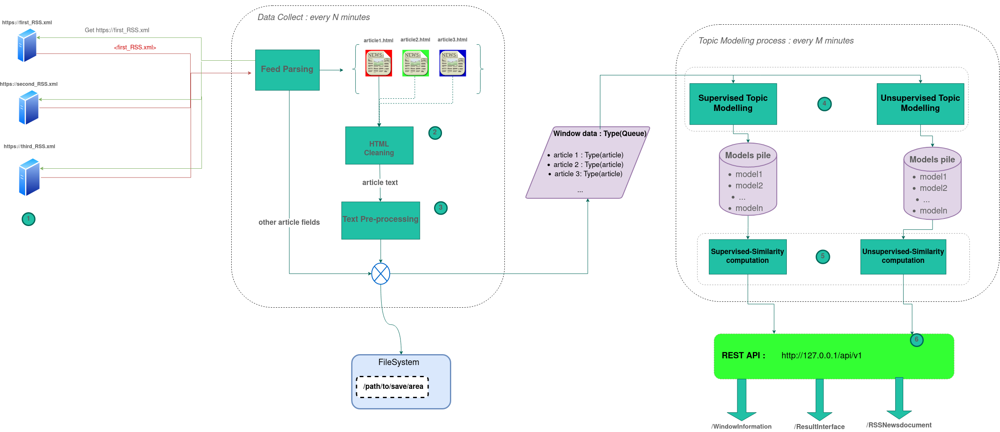

for each blue point you can refer to the section [explanation](#explanation) , this will help you to understand how to configure custom novelties-detection service.

## Installation and Execution

### Prerequisite

if you are on **Ubuntu 20.04** , you can follow the "[with shell](#with-shell)" installation section, or
you can use **Docker** , referred to in this [section](#with-docker) but first you need to install **docker-engine** on
your machine . The installation steps of docker engine for your operating systems might be slightly different,
please refer to the [docker documentation](https://docs.docker.com/engine/install/) for more details.

### with Shell

make sure that you have pip for python 3.8 installed on your machine, else you can use the following commands
for pip installation:

```bash
#Start by updating the package list using the following command:
sudo apt update
#Use the following command to install pip for Python 3:
sudo apt install python3-pip
#Once the installation is complete, verify the installation by checking the pip version:
pip3 --version

```

then you can follow the commands below to install the service and run it :

```bash
#first download repo from github and unzip.
wget https://github.com/AntMouss/Novelties-detection-project/archive/master.zip -O novelties-detection-master.zip
unzip novelties-detection-master.zip

#changes current work directory.
cd Novelties-detection-project

#create service environment
python3 -m venv ./venv

#activate environment
source ./venv/bin/activate

#install dependencies with pip
pip install -r requirements.txt

# set OUTPUT_PATH environment variable to activate writing mode and have the service persistent
# else ignore this command
export OUTPUT_PATH=<output_path>
```

Now you can run the server with the default settings, or you can set your own settings overwriting the `config/server_settings.py` file.
see [here](#server-settings) for more details about the server settings.

```bash
#launch the server
python3 server.py
```

If you don't specify `output_path` the collect service will not be **persistent³**.

### with Docker

You can build the image directly from this GitHub directory using the following command,
but you can't set custom settings this way.

```bash
# build image from github repo.
docker build --tag novelties-detection-image https://github.com/AntMouss/Novelties-detection-project.git#main
```

to use your own server settings you need to download the repository and overwrite the `config/server_settings.py` file
(learn more about [settings](#server-settings)).

Below the commands for downloading the repository and change current directory if you are on linux or bash install on your machine.

```bash
#first download repo from github and unzip.
wget https://github.com/AntMouss/Novelties-detection-project/archive/master.zip -O novelties-detection-master.zip
unzip novelties-detection-master.zip

#change current directory.
cd Novelties-detection-project

#then you can overwrite the 'config/server_settings.py' file and build the image with the command below
docker build --tag novelties-detection-image .

```

Run the container with **persistent** way.

```bash
# run container from the image that we build previously with creating volume that contain collect testing_data (persistence activate) .
docker run -d -p 5000:5000 \
--name <container_name> \
--mount source=<volume_name>,target=/collect_data \
-e OUTPUT_PATH=/collect_data \
novelties-detection-image:latest
```

or choose the no **persistent** way with the following command.

```bash
docker run -d -p 5000:5000 --name <container_name> novelties-detection-image:latest
```

Then you can check the logs of the sever to check if everything is OK , or navigate in the volume if you activate persistent way.
The server runs locally on all address with port **5000** of your machine ,
you can see the api swagger documentation at this link on your local host: *http://127.0.0.1:5000/api/v1*

```bash

# to check the logs from the container ,
# use this command with the same container_name of the command above.
docker logs <container_name>

# you can access the volume testing_data with this command if you are on Ubuntu with sudo privilege.
sudo ls /var/lib/docker/volumes/<volume_name>/_data
```

**_Note_** : The service runs on port **5000** so make sure there isn't any other applications running on this port before launching.

* provide about **10-20 GB** disk space for 3 months of collect with images collection (depends on your settings).
* provide about **1.5 GB** disk space for novelties-detection-image.

## Explanation

1. [Rss feed configuration](#1rss-feed-configuration)
2. [Article HTML cleaning](#2article-html-cleaning)
3. [Text Pre-processing](#3text-pre-processing)
4. [Topic Modeling](#4topic-modelling)
5. [Window Similarity computation](#5window-similarity-computation)
6. [API](#6api)

### 1.RSS feed configuration

**rss feed** are perfect data source to fetch information about articles in **real-time** (i.e publication date  , title , author name , label).
the rss plugging is handled by the file `config/RSS_feeds.json` , all the **rss feed** addresses must be referenced in this file.

`config/RSS_feeds.json` have two main keys : **"global_remove_tags"** and **"rss_feed_urls"** , the **"global_remove_tags"** keys referred
to a list of global **HTML tags** that we want to remove for all the HTML page of articles  during the cleaning step  (see more at [cleaning section](#2article-html-cleaning))
the **"rss_feed_urls"** key refer to a list of rss feed item that contain **"url"** , "**label"** and **"remove_tags"** fields.

* url --> url of the rss feed source
* label --> list of label related to the rss feed item , you can choose your own label (ie : sport , economy ...)
* remove_tags --> list of undesirable HTML tags specific to a particular rss feed (not globally). see more [here](#2article-html-cleaning)...

_Rss feed item example_:

```json

{
   "url" : "http://feeds.bbci.co.uk/news/world/rss.xml",
   "label" : ["sport"],
   "remove_tags" : [
      {"tag" :  "div" , "class" : "date_time_div" , "id" : "O7p469M_time_div" }, 
      {"tag" :  "span" , "class" : "author-info" , "id" : "56Ul67L_author_div" }
   ]
}
```

You can use the default `config/RSS_feeds.json` or overwrite it with your own rss feed sources following the
format describe above.

*Note*: you can add Rss source during service Runtime using [API](#6api) endpoint :  [GET] `RSSNewsfeedSource/AddRSSFeedSource`

### 2.Article HTML cleaning

<ins>**Cleaning Steps diagram :**</ins>

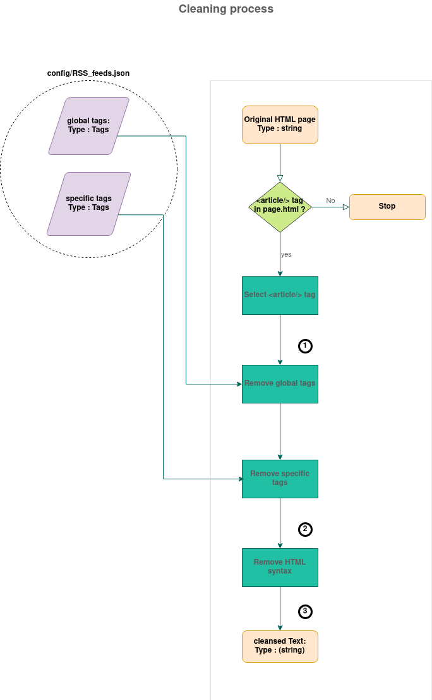

1. at the first step , we selected and kept the **<article/>** tag (content of the article) .
2. HTML page contains garbage informations like advertising , author information , references to
   next articles... that aren't interesting for the topic analysis and could pollute the [Topic modeling process](#4topic-modelling).
   since  we just wish to conserve relevant words to the topic treated in the article.
   We thus made a cleaning layer to remove undesirable tags.

There are 2 types of "undesirable" tags:

* **global** undesirable tags that we fill in the "global_remove_tags" key of the `config/RSS_feeds.json` file
* **specific** undesirable tags specific to a rss feed because article web pages have different patterns
  according to their origin ( **www.theguardians.com** hasn't same html layout than **www.nytimes.com**).

*Note*: a tag is a dictionary containing 3 keys:

* **"tag"** key is the name of the html tags to remove ( "div" , "h1" , "p" ... ).
* **"class"** key is the class name of the particular tags to remove.
* **"id"** key is the id of the particular tag to remove.

<ins> Tags example : </ins>

```json
{
  "tag" :  "div" ,
  "class" : "date_time_div" ,
  "id" : "O7p469M_time_div"
}
```

you can add tags manually overwriting the `config/RSS_feeds.json` file to custom your cleaning process before Runtime,
or you can add global tags during service Runtime using [API](#6api) endpoint `RSSNewsfeedSource/AddRSSFeedTags` during Runtime.

<ins>**Example of tags cleaning:**</ins>

Article HTML page before cleaning undesirable tags.

```html
<html>
    <article>
        <h1>
            the title of the article.
        </h1>
        <header>
            <p class="date_time">
                Monday , April 2 , 2026 15:00 UTC.
            </p class="author_info">
                Marc Duchamps (Senior reporter)
            <div class="advertising">
                <div>
                     
                     <p>
                         Buy our dumbness product !
                     </p>

                </div>

            </div>
        </header>
        <div class="real_information">
            <p>
                some information to keep after cleaning.
            </p>

        </div class="next_articles">
            <ol>
                <li>next article 1</li>
                <li>next article 2</li>
                <li>next article 3</li>
            </ol>
        <footer>
            nothing important here.
        </footer>

    </article>
</html>
```

Result after remove **global** and **specific** undesirable tags:

```html
<html>
    <article>
        <h1>
            the title of the article.
        </h1>
        <div class="real_information">
            <p>
                some information to keep after cleaning.
            </p>

    </article>
</html>
```

3. finally, we extract real article text removing all html syntax of the string:

```text
"the title of the article. some information to keep after cleaning. "
```

### 3.Text Pre-processing

In the previous section , we saw how we extract the main content of an article , now we move to the text Pre-processing step .
Topic Modelling isn't a **multilingual** process, so we had to specify a  targeted **lang** during the text preprocessing step since
we just wish to treat text in the targeted lang.

<ins>**Text Pre-Processing Steps diagram :**</ins>

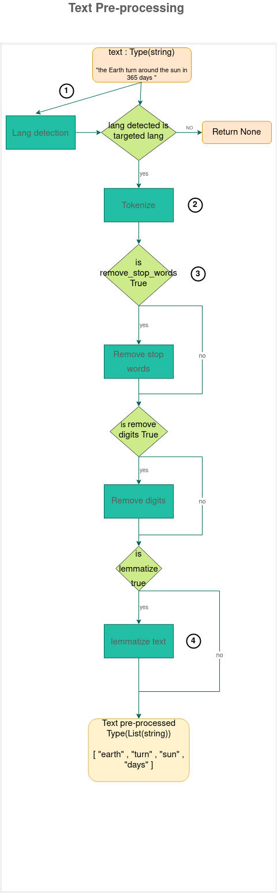

1. **lang detection** : The first step of text preprocessing is lang detection, we don't want to pre-process wrong lang text, so we are filtering.
2. **tokenization** : tokenization in NLP is a set of methods that divide string text in logical elements (called **token**)
   generally,  token are words, but it could be punctuation marker or one word could be composed of 2 tokens, as an example:
   ("geography" --> token1 : "geo" , token2 : "graph"). If you want to learn more about [tokenization](https://neptune.ai/blog/tokenization-in-nlp)
3. **remove specific words** : in the diagram , we talk about stop words and digits. **Stopwords** are common words in lang vocabulary
   which bring us no special information such as: "the" , "are" , "us" etc...
4. **Lemmatization** : in linguistics, it is the process of grouping together the inflected forms of a word so
   they can be analysed as a single item, identified by the **word's lemma**, or dictionary form.
   example : "analysed" , "analyse" , "analysing" are transformed to the lemma "analysis" after lemmatization.

<br/>

### 4.Topic Modelling

<ins>**Topic Modeling diagram :**</ins>

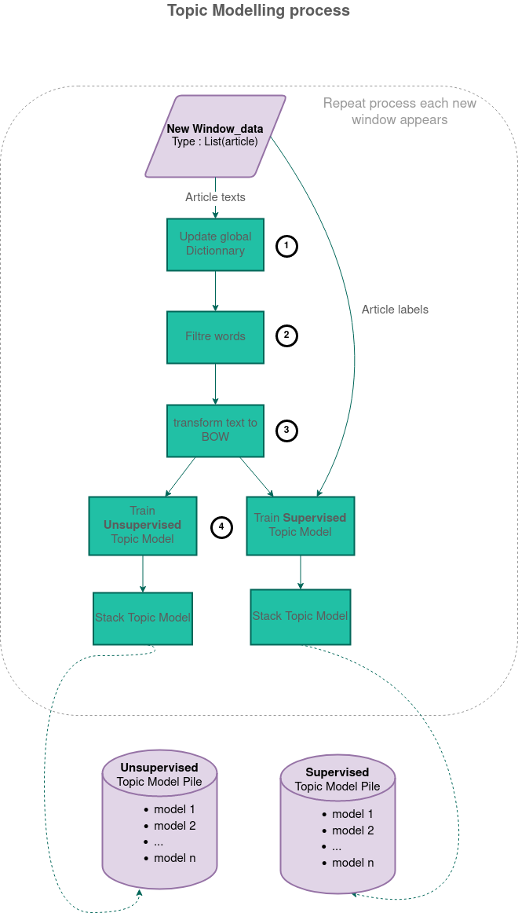

1. **update global dictionary** : we use a **global dictionary** as a register of token (words , punctuation , etc...) for all window corpus (set of article texts in the time window collect).
   The purpose of this dictionary is to count every token occurrences, although we can use it to filter rare token or really common token (which are not **Stopwords**). This dictionary is updated at every new window appearance.
2. **filter words** (or **filter tokens**) : as explained above we remove rare tokens or common tokens using the global dictionary ,
   these tokens are not topic relevant . ( ie : misspelled words "length" or common **irrelevant** words "Monday" ) .
3. **BOW** (bag of words) is a simplifying model text representation used in document classification .
   Each text in the corpus is represented as a vector where each component is the number occurrences of the token in the vocabulary index.
   This model representation is more efficient for training topic models.
4. **train model** : this part is the main part of the process , we have 2 type of training : **unsupervised training** using unlabeled texts and **supervised training** using labeled texts.
   <br/>
   The purpose of the supervised modeling is to return change for a predefined label and follow the evolution of the label in time.
   The unsupervised way is used to detect latent topics in a bunch of articles independently of paper categories (labels) , this type of training can provide us complementary information about the news composition.
   In other words , the unsupervised modeling allows us to follow the **micro topics** evolution (little topics that appears punctually in a window) while the supervised method allows us to follow big **categories** evolution (topic persisting through many windows).

We use different topic model kernels:

* unsupervised kernel : [LDA⁴](https://en.wikipedia.org/wiki/Latent_Dirichlet_allocation) , [CoreX⁵](https://github.com/gregversteeg/corex_topic)
* supervised kernel : [TFIDF⁶](https://en.wikipedia.org/wiki/Tf%E2%80%93idf) , Guided LDA (or semi-supervised LDA) , Guided CoreX (or semi-supervised CoreX)

**_Note 1_** : **Guided LDA** and **Guided CoreX** kernel are based on the **LDA** and **CoreX** kernel , the difference is that in the guided case
we use label **seed words** to make the training converge around these words.
In other words , we use set of **relevant** words specific to a label, and we increase the weight of this particular words
in the corpus during training to hook other strongly related words. This **seed words** work as **anchors** .

_**Note 2**_ :  use your own seed words relative to your labels overwriting the `config/seed.json` file
with labels as keys and list of seed words (relative to the key topics) as values else you can keep the original
`config/seed.json` file.

_Example of `config/seed.json` file_:

```json
{
  "sport" : ["ball" , "trophy" , "win" , "medal"],
  "economy" : ["dollars" , "tax" , "increase" , "inflation" , "gas"],
  "crime" : ["knife" , "witness" , "murder" , "blackmail"]
}
```

_here is the different types of **training** example diagram_:

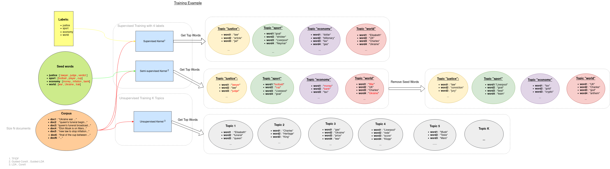

**_Note_** : we use the [Gensim](https://radimrehurek.com/gensim/models/ldamodel.html) LDA implementation.

### 5.Window Similarity computation

<ins>**Similarity Computation Steps diagram :**<ins/>

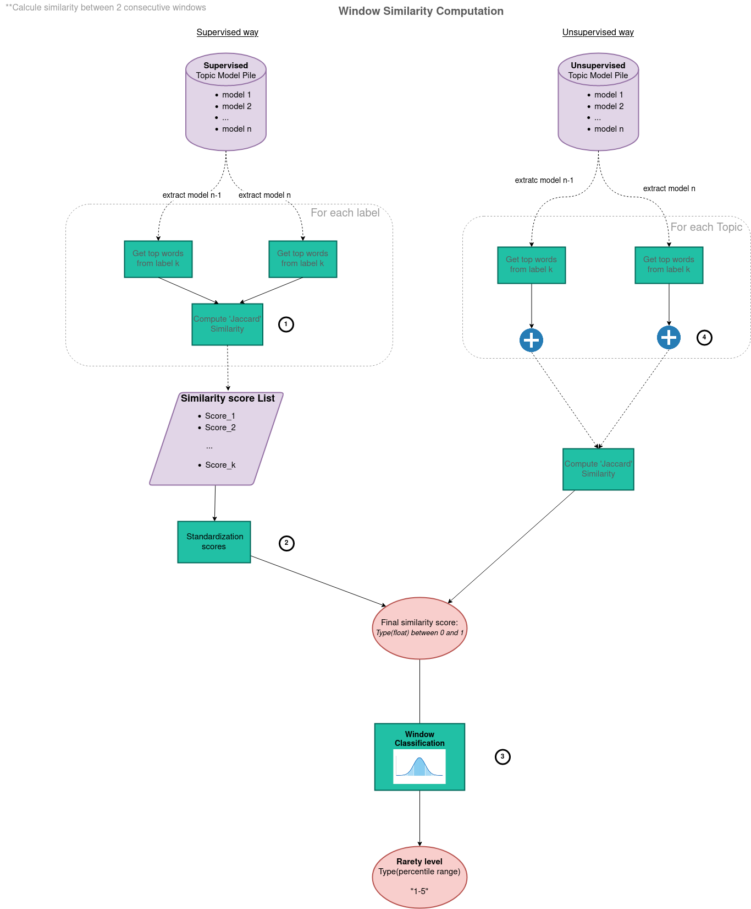

1. we use similarity calculator extracting two consecutive models corresponding to two consecutive windows, and we compute [Jaccard similarity](https://pyshark.com/jaccard-similarity-and-jaccard-distance-in-python/)
   the supervised case we compute **Jaccard similarity** for each topic corresponding to a label, and we stack similarity score in a list:
   **example** : assume the two below cluster words for the label i -> "sport":

```json
{
  "Ai" :  ["football" , "Manchester" , "united" , "devils" , "Traford" , "victory" , "goals"],
  "Bi" :  ["football" , "Manchester" , "city" , "Arsenal" , "win" , "goals"]
}
```

**Jaccard similarity** formula is:
$Ji = \frac{|Ai \cap Bi|}{|Ai \cup Bi|} = \frac{|Ai\cap Bi|}{|Ai| + |Bi| – |Ai\cup Bi|}$

here:

$Ai\cap Bi= \{"football" , "Manchester" , "goals"\}$

$|Ai\cap Bi| = 3$

and

$Ai\cup Bi= \{"football" , "Manchester" , "united" , "devils" , "Traford" , "victory" , "goals" , "city" , "Arsenal" , "win"\}$

$|Ai\cup Bi| = 10$

finally :

$Ji =\dfrac{3}{10}$

2. then ,  we standardize the similarity scores to obtain the final similarity score between the window n and n-1 :

$J = \dfrac{ \sum_{i=0}^{k}{Ji} }{k}$

3. The process isn't the same for the unsupervised case , we append every cluster of words for each topic then we compute the total Jaccard similarity.
4. Finally , we will classify the change rate between two windows using a normal distribution classifier .
   The final result is a range percentiles :

In our case , a percentile is a similarity score below which a given percentage k of scores in its frequency distribution falls (exclusive definition) or a score at or below which a given percentage falls (inclusive definition).
For example, the 90th percentile is the similarity score below which (exclusive) or at or below which (inclusive) 90% of the scores in the distribution may be found:

_you can see a representation of the 90th percentile of a normal distribution below :_

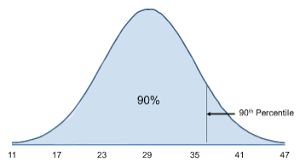

We classifie similarity between window as percentile ranges which means a window similarity could be for example $1-5%$ or $5-20%$ ... rarely high similarity or low similarity.

_Representation of percentile ranges below:_

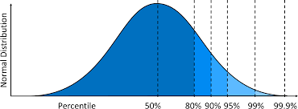

_**Note**_ : we use normal distribution because we previously analyse the distribution of our similarity calculators that fit normal distribution (this distribution is more efficient to detect abnormal change).

### 6.API

(Not available yet but you can see query doc at https://127.0.0.1:5000/api/v1  , when the service is running.)

## Server Settings

this section will help you to custom the service , most of the settings refer to the [explanation](#explanation) section.
You need to overwrite the `config/server_settings.py` file else you can keep the default settings.

### collect settings

* `LOOP_DELAY_COLLECT` : Integer --> delay **in minutes** between 2 collect process corresponding to the N value in the main [diagram](#basic-architecture-diagram) .
* `COLLECT_RSS_IMAGES` : Boolean : True --> allows the collect of images in the rss feed .
* `COLLECT_ARTICLE_IMAGES` : Boolean : True --> allows the collect of images in the article page.html.
* `COLLECT_HTML_ARTICLE_PAGE` : Boolean : True --> allows the collect of the html article.
* `PRINT_LOG` : Boolean : True --> allows log of the collect process (performance and error).

**_Note_** : The collect process can write data in **fileSystem** if you used the [persistent](#installation-and-execution) mode (specify `output_path` )
so you can set `COLLECT_RSS_IMAGES` , `COLLECT_ARTICLE_IMAGES` and `COLLECT_HTML_ARTICLE_PAGE` as True else it return an exception.

### Labels settings.

* `LABELS_IDX` : List of targeting labels .
  **_Warning_** : You can't change `LABELS_IDX` during runtime, you can't add new label because we want to keep label traceability.

### Process window settings

* `LOOP_DELAY_PROCESS` : Integer --> delay **in minutes** between 2 Windows processing corresponding to the M value in the main [diagram](#basic-architecture-diagram) .
* `MEMORY_LENGTH` : Integer --> number of window keep in memory (can't exceed 30 because of memory consumption).

**_Note_** : `LOOP_DELAY_PROCESS` must be superior to `LOOP_DELAY_COLLECT` because the processing need data collecting first
else it returns an exception.

### Text pre-processing settings

* `LANG` : Lang code of the pre-processed texts (can't pre-process text in other lang because the service isn't multilingual)
* `LEMMATIZE` : Boolean : True --> lemmatize text.
* `REMOVE_STOP_WORDS` : Boolean : True --> remove stop words.
* `REMOVE_NUMBERS` : Boolean : True --> remove numbers in text.
* `REMOVE_SMALL_WORDS` : Boolean : True --> remove small words.

Lang Supported by the service:

```
'czech'
'danish'
'dutch'
'english'
'estonian'
'finnish'
'french'
'german'
'greek'
'italian'
'norwegian'
'polish'
'portuguese'
'russian'
'slovene',
'spanish'
'swedish'
'turkish'
  
```

**_Note_** : You can specify the minimum length of a "small words" or "tall words" and you can add a predefine list of words to remove
follow the example:

```python
from novelties_detection.Collection.data_processing import MetaTextPreProcessor
# TEXT PRE-PROCESSOR SETTINGS
LANG: str = "en"
LEMMATIZE: bool = False
REMOVE_STOP_WORDS: bool = True
REMOVE_NUMBERS: bool = True
REMOVE_SMALL_WORDS: bool = True
SMALL_WORDS_SIZE = 3
my_undesirable_words = ["Monday", "March", "follow", "Twitter"]

PREPROCESSOR = MetaTextPreProcessor(
    lang=LANG,
    lemmatize=LEMMATIZE,
    remove_stop_words=REMOVE_STOP_WORDS,
    remove_numbers=REMOVE_NUMBERS,
    remove_small_words=REMOVE_SMALL_WORDS,
    min_word_size=SMALL_WORDS_SIZE,
    undesirable_words=my_undesirable_words
)
```

### Macro-calculator settings (**supervised calculator**)

Customise Macro-calculator settings overwriting the **#MACRO-CALCULATOR SETTINGS** section in `config/server_settings.py`.

* `MACRO_CALCULATOR_TYPE` : Type of the Macro-Calculator.
* `macro_training_args` : Dictionary of arguments relatives to the training of the kernel.
* `macro_kwargs_results` : Dictionary of arguments relatives to the similarity computation between windows.

_There are 3 types of Macro Calculator_ :

* `TFIDFSequentialSimilarityCalculator` : Using a TFIDF kernel (no specific training arguments available yet).
* `GuidedCoreXSequentialSimilarityCalculator` :  Using a CoreX kernel (specific training arguments in original [doc](https://github.com/gregversteeg/corex_topic/blob/master/corextopic/corextopic.py) line 18).
  _**Warning**_ : You can't use following parameters --> `n_hidden` .
* `GuidedLDASequentialSimilarityCalculator` :  Using LDA kernel (specific training arguments in original [doc](https://radimrehurek.com/gensim/models/ldamodel.html)).
  _**Warning**_ : You can't use following parameters -->  `corpus`, `num_topics`, `id2word` , `eta` .

**_Note 1_** : we already made a macro-calculator selection step (not explain here) , so the default macro-calculator is the better one for change detection.

_**Note 2**_ : As explain in [note 2](#4topic-modelling) , you need to specify seed words if you use semi-supervising learning
(`GuidedLDASequentialSimilarityCalculator` , `GuidedCoreXSequentialSimilarityCalculator`) else you can keep default seed words in `config/seed.json`
(just available for default `LANG` and default `LABELS_IDX`).

_**Note 3**_ : If you are using the 2 last class , you can specify an `anchor_strength` training parameter (semi-supervising learning)
to increase the weight of the seed words in the corpus , else you can keep the default `anchor_strength` value.

**_Warning_** : Do not confuse seed words parameters with `seed` parameters in `GuidedCoreXSequentialSimilarityCalculator` instance
that enabled reproducible training.

`macro_kwargs_results` arguments :

* `ntop` : Integer --> number of top words use to compute Jaccar similarity between 2 windows for a specific 'label'.
* `remove_seed_words` : Boolean : True --> remove seed words of label top words during Jaccar similarity computation.
* `exclusive` : Boolean : True --> remove top words that belong to many labels during Jaccar similarity computation.

_Example of Macro-Calculator settings_:

```python
from novelties_detection.Experience.Sequential_Module import GuidedLDASequentialSimilarityCalculator

# MACRO-CALCULATOR SETTINGS
MACRO_CALCULATOR_TYPE : type = GuidedLDASequentialSimilarityCalculator
macro_training_args = {
    "anchor_strength" : 100,
    "passes" : 3 ,
    "minimum_probability" : 0.2
}
macro_kwargs_results : dict = {
    "ntop" : 100,
    "remove_seed_words" : True,
    "back"  :  3
}
```

### Micro-calculator settings (**unsupervised calculator**)

Customise Micro-calculator settings overwriting the **#MICRO-CALCULATOR SETTINGS** section in `config/server_settings.py`.

* `MICRO_CALCULATOR_TYPE` : Type of the Micro-Calculator.
* `micro_training_args` : dictionary of arguments relatives to the training of the kernel.
* `NB_MI_TOPICS` : integer referring to the number of topics in each window (this number is fix for each window).

There are 2 types of Micro-Calculator :

* `CoreXSequentialSimilarityCalculatorFixed` :  using a CoreX kernel ( specific training arguments in original doc ).
  _**Warning**_ : you can't use the following parameters -->  `n_hidden` .
* `LDASequentialSimilarityCalculatorFixed` :  using LDA kernel ( specific training arguments in original doc ).
  _**Warning**_ : you can't use the following parameters -->  `corpus`, `num_topics`, `id2word` .

_Example of Micro-Calculator settings_:

```python
from novelties_detection.Experience.Sequential_Module import CoreXSequentialSimilarityCalculatorFixed
# MICRO-CALCULATOR SETTINGS
NB_MI_TOPICS = 7
MICRO_CALCULATOR_TYPE : type = CoreXSequentialSimilarityCalculatorFixed
micro_training_args = {
    "anchor_strength" : 4,
    "tree" : False
}
```

### bad words removing settings

* `fct_above` : Function which defines the maximum number of document appearances for a word otherwise it is removed from the original vocabulary.
* `fct_below` : Function which defines the minimum number of document appearances for a word otherwise it is removed from the original vocabulary.
* `kwargs_above` : Dictionary contain `fct_above` specific arguments .
* `kwargs_below` : Dictionary contain `fct_below` specific arguments .

There are 3 types of filtering functions :

* `absoluteThresholding` --> linear function with $slop = 0$
  example : with $intercept = 100$

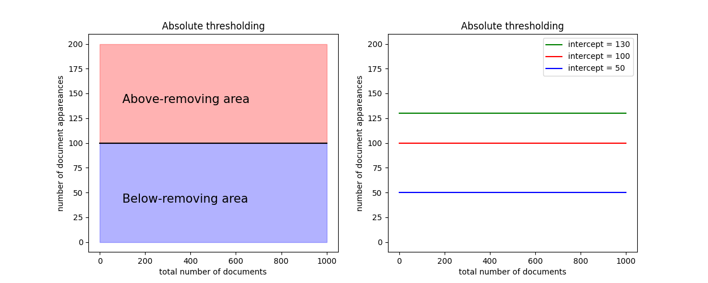

* `linearThresholding` --> linear function with $0 <= slop <= 1$
  example : with $slop = 0.25$ and $intercept = 0$

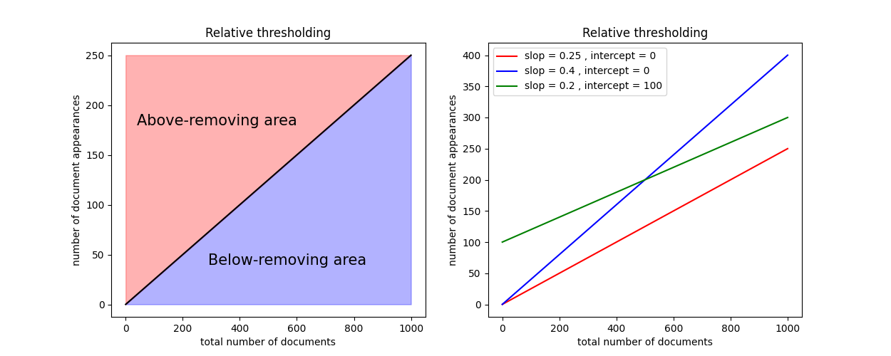

* `convLogarithmThresholding` --> logarithm reverse function with 1 argument : `limit`
  example : $limit = 0.4$

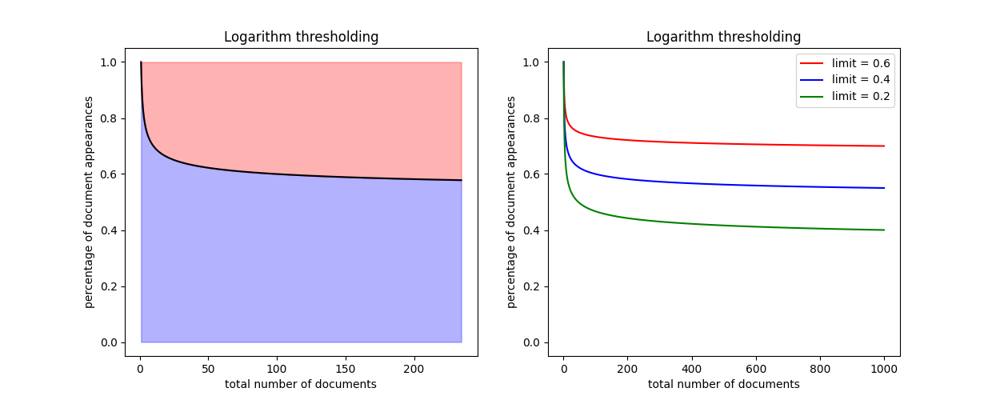

**Document appearances** --> number of documents (articles in our case) in which the considerate token (word) is present.

**Above-removing area** --> if a word is in this area the fct_above function will remove it from
the original vocabulary during [the tokens filtering](#4topic-modelling),
so it will be not considerate at the topic-modelling step .

**Below-removing area** --> if a word is in this area the fct_below function will remove it from
the original vocabulary during [the tokens filtering](#4topic-modelling),
so it will be not considerate at the topic-modelling step .

_Example of BAD WORDS SETTINGS overwriting_:

```python
from novelties_detection.Collection.data_processing import linearThresholding , absoluteThresholding
from novelties_detection.Experience.kwargs_utils import UpdateBadWordsKwargs
#BAD WORDS SETTINGS
# for remove words that no satisfying some frequency condition
fct_above = linearThresholding
fct_below = absoluteThresholding
kwargs_above : dict = {
    "limit" : 0.8,
    "intercept" : 20
  
}
kwargs_below : dict = {
    "intercept" : 4
}
bad_words_kwargs = UpdateBadWordsKwargs(
    thresholding_fct_above=fct_above ,
    thresholding_fct_below=fct_below ,
    kwargs_above=kwargs_above  ,
    kwargs_below=kwargs_below
)
```

**_Warning :_** Pay attention with the "bad words" settings for example a too high "intercept" for the "below_fct" can generate NoWordsException which mean that
no words past the filtering step , so the model consider that the texts are empty and return NoWordsException .

## Lexical

1. RSS feed : (Really Simple Syndication) is a web feed that allows users and applications to access updates to websites in a standardized, computer-readable format.
2. Topic modeling : Set of machine learning method which main purpose are to found
   relationship between words in a document corpus in order to return words clusters (topic).
3. Persistent : The persistent "mode" save the collect data to the `output_path` directory.
4. LDA : Latent Dirichlet Allocation.
5. TFIDF : term frequency–inverse document frequency.
6. CoreX : Correlation Explanation.
